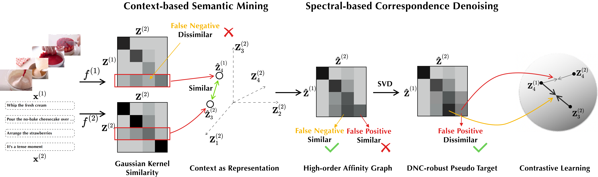

# 🍬 CANDY: Contextually-spectral based correspondence refinery

This repository contains the PyTorch implementation for CANDY proposed in paper [Robust Contrastive Multi-view Clustering against Dual Noisy Correspondence](https://openreview.net/pdf?id=6OvTbDClUn) (NeurIPS 2024).



## Requirements

### Environment

The code depends on  `pytorch`, `scikit-learn`, `scipy` and `munkres`. You can set up your environment with the following commands:

```bash
conda create -n candy python=3.11 pytorch==2.2.2 pytorch-cuda=11.8 -c pytorch -c nvidia -y
conda activate candy
pip install scikit-learn==1.3.0 scipy==1.12.0 munkres==1.1.4
```

### Datasets

Dataset used in the paper can be downloaded from [Google Drive](https://drive.google.com/drive/folders/1grIbxjm544wCa5LvPn9Ec_04HSVNZN2o?usp=sharing) or [Baidu NetDisk](https://pan.baidu.com/s/1jdOw9zRGvxdGs0KFLxFQiw?pwd=qntk). We assume that you have placed the downloaded datasets in the directory `/path/to/your/data`.

## Running

Please replace `/path/to/your/data` with the directory of your downloaded datasets. Note that arguments in the `--config_file` overrides other command line arguments.

```bash
EXPERIMENT_ROOT=/path/to/your/data python main_train.py --config_file config/Scene15.yaml --fp_ratio 0.5 --epochs 200
```

## Reference

If you find our work useful in your research, please consider citing:

```bibtex
@article{guo2024candy
    title = {Robust Contrastive Multi-view Clustering against Dual Noisy Correspondence},
    author = {Ruiming Guo and Mouxing Yang and Yijie Lin and Xi Peng and Peng Hu},
    booktitle = {Advances in Neural Information Processing Systems},
    volume = {37},
    year = {2024}
}
```

## Acknowledgement

This implementation is based on [DIVIDE](https://github.com/XLearning-SCU/2024-AAAI-DIVIDE).
